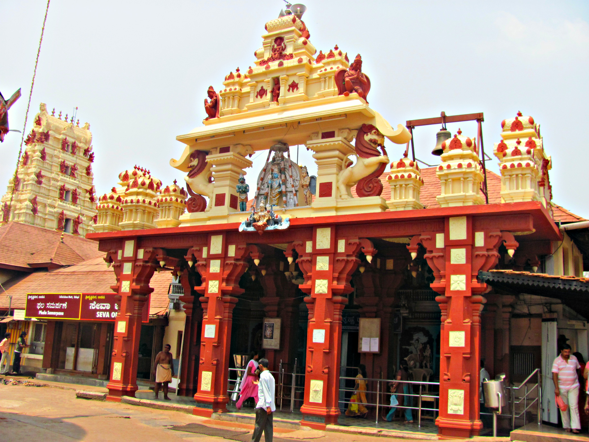
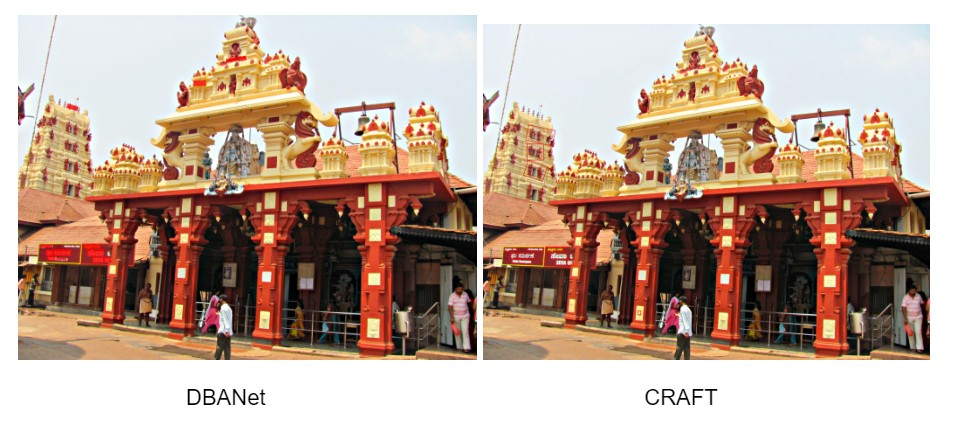

# GeoLocator

The GeoLocator application is designed to assist in location identification from anonymous images, integrating several machine learning techniques to provide accurate predictions. The key components of the application include:

- Indoor/Outdoor Scene Recognition: The application first classifies whether an image depicts an indoor or outdoor scene, providing context for further geolocation processing.
- GeoCLIP (Location Prediction): Utilizing the CLIP model, the application generates image embeddings and correlates them with geographical latitude and longitude data to predict the likely location. This enables rough geolocation based on visual features.
- Text Detection/ Spotter: If textual information is present in the image, the tool detects the script and identifies the language, adding additional context for location inference.
- OCR (Optical Character Recognition): The application applies OCR to extract visible text from images, which may include signs, street names, or other clues useful for location detection.
- Named Entity Recognition (NER): Finally, the extracted text undergoes Named Entity Recognition to identify geographical entities such as cities, countries, or landmarks, refining the location prediction.

By combining these techniques, GeoLocator provides a powerful tool for identifying regions from anonymous images without metadata, aiding law enforcement and investigators in tracking crime scenes.


## Installation and Setup

### Clone the repository:
```bash
git clone https://github.com/UMass-Rescue/GeoLocator.git
cd GeoLocator
```
### Install the requirements:
```bash
pip install -r requirements.txt
```
### Run Backend
```bash
python flaskml-server.py
```
### Rescue Desktop
Use Rescue Desktop UI for a seamless user experience
Register the model application using the IP address and port
You can submit a job by running the registered GeoLocator model and providing images and the JSON file in which you want the response to be saved.


## Individual Phases Explanation

### Phase 1: Indoor Outdoor Classification

### Phase 2: GeoCLIP

### Phase 3:  Text Spotter


### Phase 4 and 5: Text Extraction with OCR and NER
This project performs Optical Character Recognition (OCR) and Named Entity Recognition (NER) on images using EasyOCR and spaCy. We utilize the TextOCR dataset to extract text from images, detect the language, and identify geopolitical entities (locations) within the extracted text.

#### Key Dependencies

- **easyocr**: For OCR text extraction from images.
- **spacy**: For Named Entity Recognition (NER) with language models `en_core_web_trf` (English transformer-based model) and `xx_ent_wiki_sm` (multilingual).
- **langdetect**: For detecting the language of the extracted text.
- **tqdm**: For displaying progress bars.
- **pandas**: For data handling and analysis.
- **Pillow**: For image processing.


#### Download the required spaCy models:
```bash
python -m spacy download en_core_web_trf
python -m spacy download xx_ent_wiki_sm
```
#### Usage
Set Up Image Paths: Update the `image_paths` list in the script with the paths to your images.

Run the Script:
```bash
python text-extraction.py
```
The script will:

- Extract text from each image using EasyOCR.
- Detect the language of the extracted text.
- Load the appropriate spaCy NER model based on the detected language.
- Clean the OCR text for better NER performance.
- Use spaCy NER and PhraseMatcher to detect locations.
- Use a regex fallback to match additional locations if needed.

#### Code Structure
- OCR Extraction: Uses EasyOCR to extract text from images.
- Language Detection: Detects the language of the extracted text using `langdetect` to choose the appropriate NER model.
- Text Cleaning: Cleans the OCR output text to improve NER performance.
- Named Entity Recognition (NER): Identifies geopolitical entities (locations) using spaCy.
- PhraseMatcher: Matches known locations using spaCy's PhraseMatcher.
- Regex Fallback: Uses regex to match additional locations based on predefined patterns if no locations are detected.

#### Notes
- Ensure you have a GPU available to leverage `gpu=True` in EasyOCR for faster processing.
- Update the `known_locations` list in the PhraseMatcher function to add or modify location patterns as needed.
- Modify the `image_paths` list with paths to the images you want to process.

## Part 1: GeoCLIP Implementation
To initialise geoclip model

    !python geoclip/run.py

When the application instance is launched, a pop-up window appears, allowing the user to select the image for which they want to determine the geographic location. The model then provides 10 possible latitude and longitude coordinates and identifies the states corresponding to these 10 geographic locations.

## Part 2: Test Spotter
### CRAFT Implementation
To Test Craft implementation, run the following commands

    %cd TextSpotter/Craft
    !python test.py --trained_model="weights/craft_mlt_25k.pth" --test_folder={folder of test images}


### MMOCR Implementation
To test mmocr implementation, execute following commands

      %cd TextSpotter/mmocr
      !mim install -e .
      !python tools/infer.py {testfolder/image} --det {textdetectormodel: For eg. DBNet} --print-result

### Sample


For Image:
|
|:--:|
| <b> Fig.1 -  Test Image </b>|


Output Predicted by Craft and DBANEt
For Image:
|
|:--:|
| <b> Fig.1 -  Output Image </b>|


## Citation
If you find our work useful in your research, please consider citing:  

    @article{mmocr2021,
    title={MMOCR:  A Comprehensive Toolbox for Text Detection, Recognition and Understanding},
    author={Kuang, Zhanghui and Sun, Hongbin and Li, Zhizhong and Yue, Xiaoyu and Lin, Tsui Hin and Chen, Jianyong and Wei, Huaqiang and Zhu, Yiqin and Gao, Tong and Zhang, Wenwei and Chen, Kai and Zhang, Wayne and Lin, Dahua},
    journal= {arXiv preprint arXiv:2108.06543},
    year={2021}
    }

    @inproceedings{10.5555/3666122.3666501,
    author = {Cepeda, Vicente Vivanco and Nayak, Gaurav Kumar and Shah, Mubarak},
    title = {GeoCLIP: clip-inspired alignment between locations and images for effective worldwide geo-localization},
    year = {2024},
    publisher = {Curran Associates Inc.},
    address = {Red Hook, NY, USA},
    booktitle = {Proceedings of the 37th International Conference on Neural Information Processing Systems},
    articleno = {379},
    numpages = {12},
    location = {New Orleans, LA, USA},
    series = {NIPS '23}
    }

    @inproceedings{baek2019character,
    title={Character Region Awareness for Text Detection},
    author={Baek, Youngmin and Lee, Bado and Han, Dongyoon and Yun, Sangdoo and Lee, Hwalsuk},
    booktitle={Proceedings of the IEEE Conference on Computer Vision and Pattern Recognition},
    pages={9365--9374},
    year={2019}
    }

    @article{zhou2017places,
    title={Places: A 10 million Image Database for Scene Recognition},
    author={Zhou, Bolei and Lapedriza, Agata and Khosla, Aditya and Oliva, Aude and Torralba, Antonio},
    journal={IEEE Transactions on Pattern Analysis and Machine Intelligence},
    year={2017},
    publisher={IEEE}
    }

