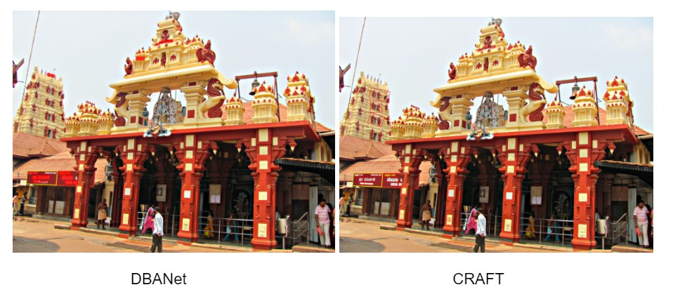

# GeoLocator

## Part 0: Install requirements
To install dependencies execute the following command

    pip install -r requirements.txt

## Part 1: GeoCLIP Implementation
To initialise geoclip model

    !python geoclip/run.py

When the application instance is launched, a pop-up window appears, allowing the user to select the image for which they want to determine the geographic location. The model then provides 10 possible latitude and longitude coordinates and identifies the states corresponding to these 10 geographic locations.

## Part 2: Test Spotter
### CRAFT Implementation
To Test Craft implementation, run the following commands

    %cd TextSpotter/Craft
    !python test.py --trained_model="weights/craft_mlt_25k.pth" --test_folder={folder of test images}

### MMOCR Implementation
To test mmocr implementation, execute following commands

      %cd TextSpotter/mmocr
      !mim install -e .
      !python tools/infer.py {testfolder/image} --det {textdetectormodel: For eg. DBNet} --print-result

### Sample

For Image:
|
|:--:|
| <b> Fig.1 -  Test Image </b>|

Output Predicted by Craft and DBANEt
For Image:
|
|:--:|
| <b> Fig.1 -  Output Image </b>|

## Citation
If you find our work useful in your research, please consider citing:  

    @article{mmocr2021,
    title={MMOCR:  A Comprehensive Toolbox for Text Detection, Recognition and Understanding},
    author={Kuang, Zhanghui and Sun, Hongbin and Li, Zhizhong and Yue, Xiaoyu and Lin, Tsui Hin and Chen, Jianyong and Wei, Huaqiang and Zhu, Yiqin and Gao, Tong and Zhang, Wenwei and Chen, Kai and Zhang, Wayne and Lin, Dahua},
    journal= {arXiv preprint arXiv:2108.06543},
    year={2021}
    }

    @inproceedings{10.5555/3666122.3666501,
    author = {Cepeda, Vicente Vivanco and Nayak, Gaurav Kumar and Shah, Mubarak},
    title = {GeoCLIP: clip-inspired alignment between locations and images for effective worldwide geo-localization},
    year = {2024},
    publisher = {Curran Associates Inc.},
    address = {Red Hook, NY, USA},
    booktitle = {Proceedings of the 37th International Conference on Neural Information Processing Systems},
    articleno = {379},
    numpages = {12},
    location = {New Orleans, LA, USA},
    series = {NIPS '23}
    }

    @inproceedings{baek2019character,
    title={Character Region Awareness for Text Detection},
    author={Baek, Youngmin and Lee, Bado and Han, Dongyoon and Yun, Sangdoo and Lee, Hwalsuk},
    booktitle={Proceedings of the IEEE Conference on Computer Vision and Pattern Recognition},
    pages={9365--9374},
    year={2019}
    }

     @article{zhou2017places,
   title={Places: A 10 million Image Database for Scene Recognition},
   author={Zhou, Bolei and Lapedriza, Agata and Khosla, Aditya and Oliva, Aude and Torralba, Antonio},
   journal={IEEE Transactions on Pattern Analysis and Machine Intelligence},
   year={2017},
   publisher={IEEE}
    }

